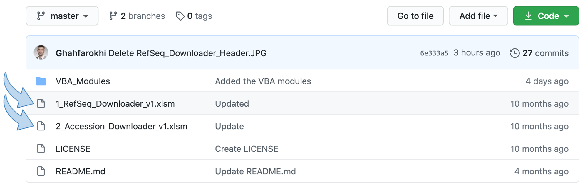
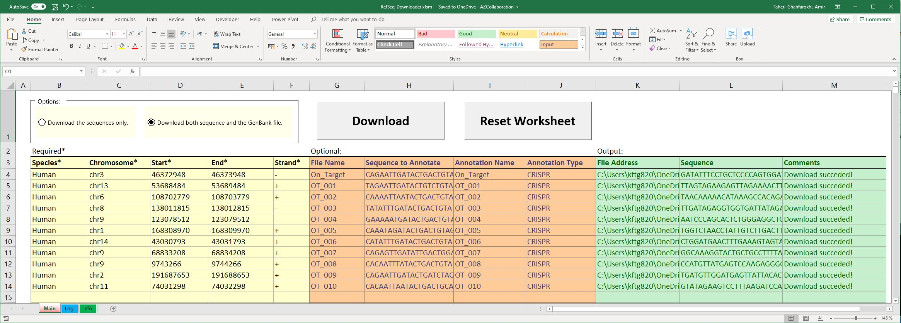
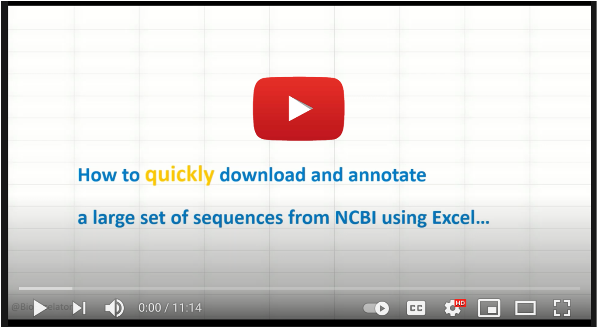
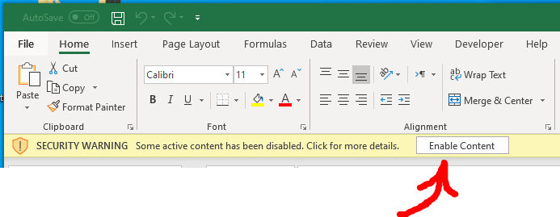
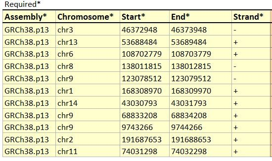
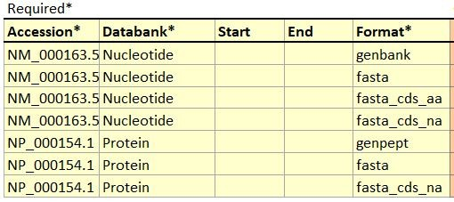
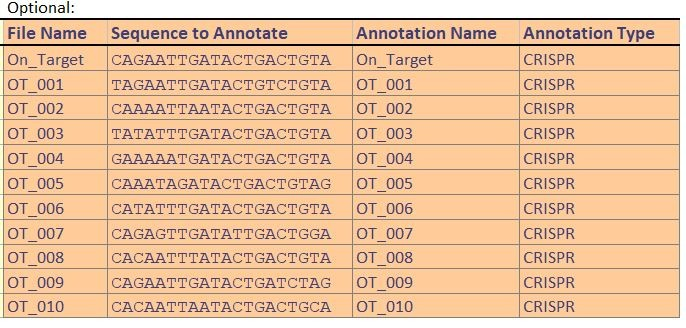
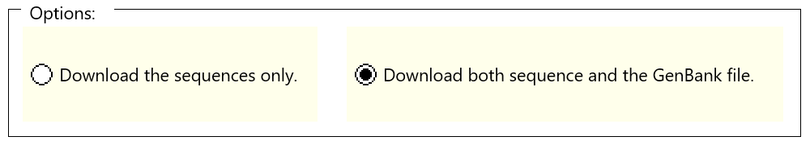
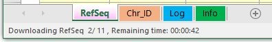
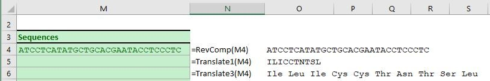

# Retrieve and Annotate Sequences from NCBI using Excel

A macro-enabled Excel workbook, which could be used to download and annotate sequences for a large set of genomic coordinates or accession numbers from NCBI using Microsoft Excel workbooks. 

---

## Supported systems

* Windows

## Requirements

* Microsoft Excel 2016 or higher

* Internet Connection

## Installation

 * None, just enable macros using the pop up bar, which appears upon opening the workbooks.

## Tools

* **RefSeq-Downloader-v1.xlsm**: downloads genbank files and seuences for a range of genomic coordinates *e.g., Chr1:1000000-1001000*.

* **Accession-Downloader-v1.xlsm**: downloads genbank files and sequences for a list of accession numbers *e.g., NM_000163.5*.

---

## Instruction

#### Youtube

Wath the detailed guideline on youtube:

#### Step-by-step guideline

1. Download a copy of the excel files on your desktop. Enable the macros using the pop-up menu which appears upon opening the workbooks.

2. Populate the user_input table with required genomic coordinates (example input is provided in the ”Info” worksheet). 

* **RefSeq-Downloader-v1.xlsm**: genomic coordinates:

* **Accession-Downloader-v1.xlsm**: accession numbers:

3. Optionally, a sequence to be annotated on the Genbank file could also be provided:

4. Choose if you want (or don’t want) the GenBank files to be saved on your computer and click download. Genbank or fasta files can be found in the same folder where Excel workbooks are stored.

5. You can track the progress by checking the Excel status bar. You will be notified when the download is complete. GenBank files will be saved within the folder of the the Excel workbook. Check the "Log" worksheet for the success/failure for each file.

6. There are other additional functions available in the workbooks for Reverse Complement and Translations of the sequences:

## Limitations
 * The maximum number of genomic coordinates to be downloaded at one go is limited to 1000 to avoid the Excel application running out of memory.

* The maximum length of a genomic region to download is 300,000 bp.

* The maximum length of a sequence in an Excel' cell is 32,767.

* Currently, only a dozen of "popular" assemblies are added (provided in the info worksheet). Watch the instruction on YouTube to learn how to add other genome assemblies from other organisms.

--- 

## Download materials

